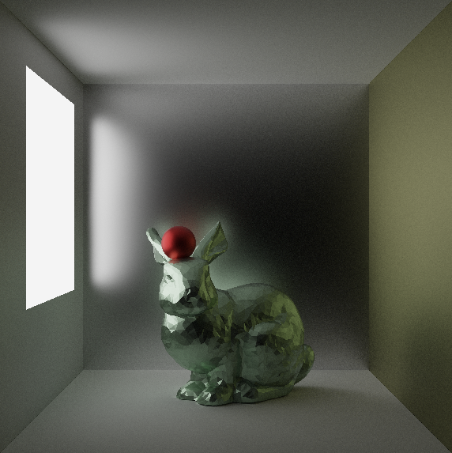

# Differentiable Path Tracing via path replay backprop for material optimization (Warp + OpenUSD)

This is a hello-world project for learning the basics of differentiable rendering and differentiable programming in general.

## Demos

https://github.com/user-attachments/assets/1a08466d-fe19-4125-b05e-05b85c06741b

```bash
uv run ./src/main.py --num-epochs 300 --lr-range 0.03:0.3 --lr-spp-range 5:15 --target-image ./_output/target/cornell_sphere_test_target.hdr --usd-path ./stages/cornell_sphere_test.usda --save-path ./_output/learned --spp 100 --resample-interval 10
```

## Setup and running the project

### Prerequisites
- CUDA-capable GPU and CUDA toolkit installed
- Python 3.12

### Boostrap the project
Run the following command to initialize the venv (if needed) and see the available program options:

```bash
uv run ./src/main.py -h
```

## Stochastic Path Tracing



This project implements a simple wavefront-style path tracer with the following features:
1. Multiple importance sampling using direct light sampling (next event estimation)
2. Metallic-roughness material workflow using a Trowbridge–Reitz NDF with Smith $G$, and Fresnel via Schlick

To render a simple stage with 1000 samples per pixel:

```bash
uv run ./src/main.py --spp 1000 --usd-path ./stages/cornell_sphere_target.usda --save-path ./_output/target
```
By default, the render output will be saved as raw HDR to `./_output/target/cornell_sphere_target.hdr`.

To save an 8-bit tonemapped PNG instead, add `--save-png`.

## Learning the Materials via Differentiable Rendering

The derivative of the light transport integral is computed using the path replay technique described in [Path Replay Backpropagation](https://dvicini.github.io/path-replay-backpropagation/)

Some Simplifications:
1. The target image is usually self-rendered from exactly the same camera settings with exactly the same visible geometries as the learning stage. This makes everything smooth and avoids discontinuities introduced by visibility changes.
2. The target image is expected to be in linear color space (i.e. raw HDR).
3. Only base color, roughness, and metallic are optimized.
4. Instead of doing a space-efficient adjoint path transport with only BSDF auto-differentiated, I brute-force cache as many primal rendering states as needed and auto-diff the kernal that replays the cached path. This is just a quick and dirty solution to get the job done.

```bash
uv run ./src/main.py --num-epochs 300 --lr-range 0.03:0.3 --lr-spp-range 5:15 --target-image ./_output/target/cornell_sphere_test_target.hdr --usd-path ./stages/cornell_sphere_test.usda --save-path ./_output/learned --spp 100 --resample-interval 10
```

This will try to fit the materials of the meshes in the given stage `./stages/cornell_sphere_test.usda` to the target image.

### Learning Rate and SPP Scheduling
The learning rate is scheduled smoothly over the course of 300 epochs (it starts at the higher value and decays to the lower value specified by the range `--lr-range`). I borrow the term "epoch" from machine learning to mean one complete pass through the primal rendering and replay rendering.

As with most Monte Carlo estimators, the replay gradient is noisy; in practice training can stall due to high variance (hitting a noise floor / plateau). Similar to how we adjust learning rate, training SPP is gradually increased to reduce gradient variance in later epochs (specified by the range `--lr-spp-range`).

### Latent Space Encoding
Learnable material parameters are encoded in an unconstrained latent space and decoded back to valid ranges. Concretely (see `src/learning.py`):
- Base color: sigmoids
- Roughness: log space + projection
- Metallic: log space + projection

### Reseeding
To avoid overfitting to a single fixed Monte Carlo sample set, we reseed the RNG every N epochs. This is specified by `--resample-interval`.


## Utility Scripts

### Convert HDR to PNG

To convert an HDR image to a PNG image:

```bash
uv run ./src/render_utils.py hdr_to_png ./_output/target/cornell_sphere_test_target.hdr -o ./_output/target/cornell_sphere_test_target.png
```

### Visualize BRDF Lobe
To visualize a BRDF lobe for given material parameters:

```bash
uv run ./src/material.py --base-color 0.8 0.8 0.8 --metallic 0.0 --roughness 0.5 --ior 1.5 --n-samples 1000 --direction 1.0 1.0 1.0 --stochastic
```

This command visualizes the BRDF lobe for a material with base color (0.8, 0.8, 0.8) in linear RGB (in $[0,1]$), metallic 0.0, roughness 0.5, and IOR 1.5, given the outgoing direction (1.0, 1.0, 1.0) (normalized internally), or equivalently, when light is incident from the inverse of this direction.

With `--stochastic`, the script will also call `mat_sample` to generate stochastic samples in addition to the hemisphere mesh warped by the BRDF. This helps verify the correctness of the sampling method; the red dots (samples) should lie approximately on the lobe mesh.


